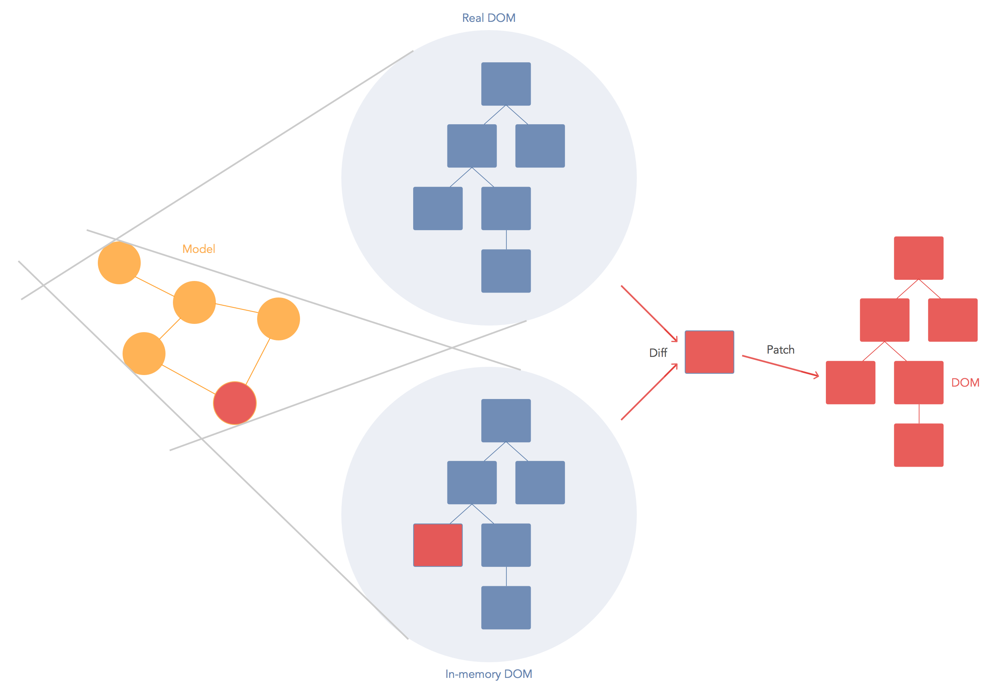

<!-- prettier-ignore -->
***

## Event Handling

```jsx
let counter = 0;
const addOne = event => {
  console.log('clicked', event);
};
const template = (
  <div>
    <button onClick={addOne}>+</button>
  </div>
);
```

Event are camel-cased.

The event handler will receive a [SyntheticEvent](https://reactjs.org/docs/events.html) <br> (a cross-browser wrapper around the browser’s native event)

Almost all browser [events](https://reactjs.org/docs/events.html#supported-events) are supported.

<!-- prettier-ignore -->
***

### Event Handling

This doesn't work

```jsx
let counter = 0;
const addOne = () => {
  console.log('clicked');
  counter = counter + 1;
};
const template = (
  <div>
    <p>{counter}</p>

    <button onClick={addOne}>+</button>
    <button onClick={() => counter--}>-</button>
  </div>
);
```

The `counter` is NOT automatically updated in the page.

> JSX doesn't support data binding! <br>Its just rendering the value.

<!-- prettier-ignore -->
***

### Event Handling

Fix

```jsx
let counter = 0;
const addOne = () => {
  console.log('clicked');
  counter = counter + 1;
};
render();

function render() {
  const template = (
    <div>
      <p>{counter}</p>

      <button onClick={addOne}>+</button>
      <button onClick={() => counter--}>-</button>
    </div>
  );
  ReactDOM.render(template, document.getElementById('root'));
}
```

The (virtual) DOM is rendered on every change!

<!-- prettier-ignore -->
***

## Virtual DOM vs DOM



Direct DOM manipulation is slow. Through the virtual DOM we only apply a patch for the diff.

---

# Exercise 1

### User List (JSX)

- Use raw JSX (no react)
- Show list of users in table
- Use users list from user.js
- Styling with bootstrap

<br>
### Tips

```
// install bootstrap 3.x

  yarn add bootstrap@3

// import bootstrap

  import 'bootstrap/dist/css/bootstrap.css';

// doc: styling

  https://www.w3schools.com/bootstrap/bootstrap_tables.asp
```
